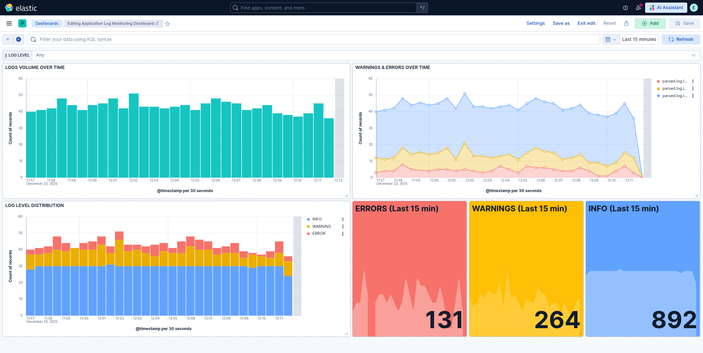

# 🚀 ELK Log Monitoring Dashboard

This project demonstrates a **real-world, end-to-end log monitoring and alerting system** built using the **Elastic Stack (ELK)** on the **free tier**. The system continuously generates application logs using a Python program, ships them with Filebeat, parses and enriches them through an Elasticsearch ingest pipeline, visualizes insights in Kibana dashboards, and raises alerts when ERROR logs spike — providing real-time observability into application health.

✨ What makes this project interactive and useful:
✔ Live log generation  
✔ Real-time dashboards (last 15 minutes)  
✔ Severity-based metrics (INFO / WARNING / ERROR)  
✔ Color-driven health indicators  
✔ Automated alerting for ERROR spikes  
✔ Fully reproducible using open-source tooling  

🧰 The stack used includes Elasticsearch 8.19.x, Kibana 8.19.x, Filebeat 8.19.x, Python 3.10+, running on Ubuntu 22.04/24.04. The repository is structured to clearly separate concerns such as log shipping, parsing, visualization, alerting, and application code.

📁 Repository layout:
elk-log-monitoring/
├── alerts/
│   └── error-spike-rule.json
├── filebeat/
│   └── filebeat.yml
├── ingest-pipeline/
│   └── python-logs-pipeline.json
├── kibana/
│   └── dashboards.ndjson
├── python-app/
│   ├── app.py
│   └── requirements.txt
├── screenshots/
│   └── dashboard.png
└── README.md

🖥️ Dashboard Preview (real-time visualization with color-coded severity):

⚙️ How the system works in practice:
After installing Elasticsearch, Kibana, and Filebeat, Elasticsearch and Kibana services are enabled and started. An ingest pipeline is created using the provided JSON file so that incoming logs are parsed and enriched correctly. Filebeat is then configured using the supplied configuration file and restarted. The Python application is executed to continuously generate logs. Filebeat ships these logs to Elasticsearch, Kibana visualizes them in near real-time, and alert rules monitor ERROR log behavior.

🔧 Commands used in setup and operation:
sudo apt update  
sudo apt install elasticsearch kibana filebeat  
sudo systemctl enable --now elasticsearch kibana  

curl -X PUT "http://localhost:9200/_ingest/pipeline/python-logs?pretty" -H "Content-Type: application/json" --data-binary "@ingest-pipeline/python-logs-pipeline.json"  

sudo systemctl restart filebeat  

cd python-app  
python3 app.py  

📊 Kibana dashboards are imported using `kibana/dashboards.ndjson` through Stack Management → Saved Objects → Import. Alerts are recreated in Kibana using the configuration defined in `alerts/error-spike-rule.json`, which triggers when ERROR log counts exceed a defined threshold within a five-minute window.

🎯 The final outcome is a **live, interactive observability dashboard** that allows operators to immediately understand application behavior, spot anomalies through color-coded indicators, and receive alerts before issues escalate.

👨‍💻 Author: **Nikhil Acholiya**  
📜 License: Intended for learning, demonstration, and portfolio use.
